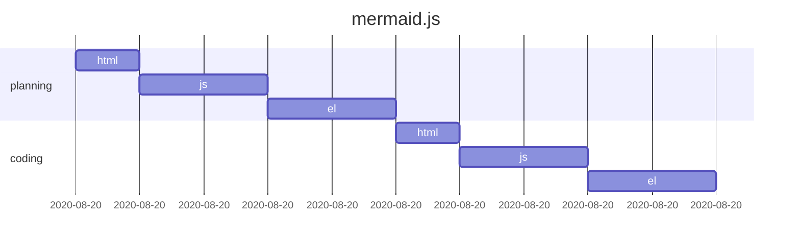

Markdown document
=================

# Installation

1. aa

2. bb

# Using

* settings

  ```lisp
  (setq foo \"bar\")  ; comment
  ```

* bb

  | a1 | b1 | c1 | d1 |
  |----|----|----|----|
  | a2 | b2 | c2 | d2 |
  | a3 | b3 | c3 | d3 |

# Security

  - [x] aabbcc
  - [ ] ddeeff

# etc



